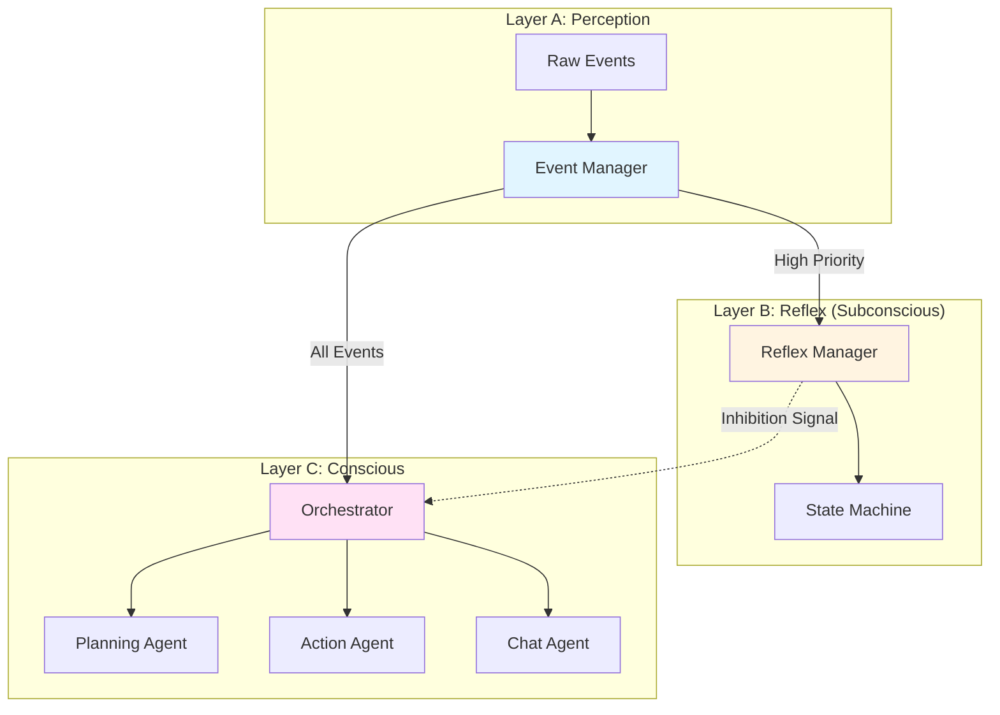

# ⛏️ Minecraft agent player for [アイリ (AIRI)](https://airi.moeru.ai)

> [!NOTE]
>
> This project is part of the [Project アイリ (AIRI)](https://github.com/moeru-ai/airi), we aim to build a LLM-driven VTuber like [Neuro-sama](https://www.youtube.com/@Neurosama) (subscribe if you didn't!) if you are interested in, please do give it a try on [live demo](https://airi.moeru.ai).

An intelligent Minecraft bot powered by LLM. AIRI can understand natural language commands, interact with the world, and assist players in various tasks.

## 🎥 Preview


## ✨ Features

- 🗣️ Natural language understanding
- 🏃‍♂️ Advanced pathfinding and navigation
- 🛠️ Block breaking and placing
- 🎯 Combat and PvP capabilities
- 🔄 Auto-reconnect on disconnection
- 📦 Inventory management
- 🤝 Player following and interaction
- 🌍 World exploration and mapping

## 🚀 Getting Started

### 📋 Prerequisites

- 📦 Node.js 23+
- 🔧 pnpm
- 🎮 A Minecraft server (1.20+)

### 🔨 Installation

1. Clone the repository:

```bash
git clone https://github.com/moeru-ai/airi.git
cd services/minecraft
```

2. Install dependencies:

```bash
pnpm install
```

3. Create a `.env.local` file with your configuration:

> [!NOTE]
> For all online accounts, un-comment the following line to toggle Microsoft authentication.
> Link for authentication will popup when the bot starts.
>
> After signed in, according to [how Minecraft protocol was implemented](https://github.com/PrismarineJS/node-minecraft-protocol/blob/bf89f7e86526c54d8c43f555d8f6dfa4948fd2d9/src/client/microsoftAuth.js#L7-L16)
> and also, [authentication flow implemented here](https://github.com/PrismarineJS/prismarine-auth/blob/1aef6e1387d94fca839f2811d17ac6659ae556b4/src/MicrosoftAuthFlow.js#L59-L69),
> the token will be cached with [the cache IDs specified here](https://github.com/PrismarineJS/prismarine-auth/blob/1aef6e1387d94fca839f2811d17ac6659ae556b4/src/MicrosoftAuthFlow.js#L88-L93)
> in split files:
>
> - `${hash}_live-cache.json`
> - `${hash}_mca-cache.json`
> - `${hash}_xbl-cache.json`
>
> inside of the directory provided by [`minecraft-folder-path`](https://github.com/simonmeusel/minecraft-folder-path)
>
> Linux: `~/.minecraft/nmp-cache/`
> macOS: `~/Library/Application Support/minecraft/nmp-cache/`
> Windows: `%appdata%/.minecraft/nmp-cache/`
>
> where `${hash}` is the `sha1` hash of the username you signing in with (as Minecraft username).

```env
OPENAI_API_KEY=your_openai_api_key
OPENAI_API_BASEURL=your_openai_api_baseurl

BOT_USERNAME=your_bot_username
BOT_HOSTNAME=localhost
BOT_PORT=25565
BOT_AUTH='microsoft' # comment if you use offline mode
BOT_VERSION=1.20
```

1. Start the bot:

```bash
pnpm dev
```

## 🎮 Usage

Once the bot is connected, you can interact with it using chat commands in Minecraft. All commands start with `#`.

### Basic Commands

- `#help` - Show available commands
- `#follow` - Make the bot follow you
- `#stop` - Stop the current action
- `#come` - Make the bot come to your location

### Natural Language Commands

You can also give the bot natural language commands, and it will try to understand and execute them. For example:

- "Build a house"
- "Find some diamonds"
- "Help me fight these zombies"
- "Collect wood from nearby trees"

## 🧠 Cognitive Architecture

AIRI's Minecraft agent is built on a **three-layered cognitive architecture** inspired by cognitive science, enabling both reactive and deliberate behaviors. This design allows the bot to respond instantly to urgent situations while maintaining the ability to plan and execute complex tasks.

### Architecture Overview



### Layer A: Perception

**Location**: `src/cognitive/perception/`

The perception layer acts as the sensory input hub, receiving and preprocessing all events from the Minecraft world and external sources.

**Components**:
- **Event Manager** (`event-manager.ts`): Centralized event distribution system
  - Emits standardized `BotEvent` objects
  - Supports event prioritization (TODO: salience detection)
  - Manages temporal context (TODO: short-term event memory)

**Event Types**:
- `user_intent`: Player chat messages, voice commands
- `world_update`: Block changes, entity movements, damage events
- `system_alert`: Internal system notifications

**Event Flow**:
```typescript
// Example: Chat message → Event
{
  type: 'user_intent',
  payload: { content: 'build a house' },
  source: { type: 'minecraft', id: 'player123' },
  timestamp: 1234567890,
  priority: 0,  // Default priority
  handled: false // Not yet processed
}
```

### Layer B: Reflex

**Location**: `src/cognitive/reflex/`

The reflex layer handles immediate, instinctive reactions without LLM overhead. It operates on a finite state machine (FSM) pattern for predictable, fast responses.

**Components**:
- **Reflex Manager** (`reflex-manager.ts`): Coordinates all reflex behaviors
  - Subscribes to high-priority events
  - Executes instant responses
  - Sets inhibition signals to prevent unnecessary LLM calls

**Current Reflexes**:
- ✅ **Greeting Reflex**: Instantly responds to "hi" or "hello"
- 🚧 **Dodge Reflex** (TODO): Avoid incoming projectiles
- 🚧 **Survival Reflex** (TODO): Auto-eat when hungry, flee from danger

**Inhibition Mechanism**:
When a reflex handles an event, it sets `event.handled = true`, preventing the expensive Conscious layer from processing the same event.

```typescript
// Example: Greeting reflex
if (content === 'hi') {
  bot.chat('Hi there! (Reflex)')
  event.handled = true // Inhibit Conscious processing
}
```

### Layer C: Conscious

**Location**: `src/cognitive/conscious/`

The conscious layer handles complex reasoning, planning, and decision-making using LLM-powered agents.

**Components**:
- **Orchestrator** (`orchestrator.ts`): Main coordinator for deliberate actions
  - Checks inhibition signals from Reflex layer
  - Manages processing state (prevents concurrent operations)
  - Coordinates Planning → Execution → Response flow

- **Planning Agent**: Creates multi-step plans to achieve goals
- **Action Agent**: Executes atomic actions (move, mine, build)
- **Chat Agent**: Generates natural language responses

**Processing Pipeline**:
```
1. Check Inhibition → 2. Update Memory → 3. Create Plan →
4. Execute Actions → 5. Generate Response → 6. Reply
```

**State Management**:
- Uses `isProcessing` lock to prevent race conditions
- Future: Queue system for handling concurrent intents

### 🔄 Event Flow Example

**Scenario 1: Simple Greeting (Reflex)**
```
Player: "hi"
  ↓
[Perception] EventManager emits user_intent
  ↓
[Reflex] ReflexManager detects greeting → Replies instantly
  ↓
[Conscious] Orchestrator sees handled=true → Skips processing
```

**Scenario 2: Complex Command (Conscious)**
```
Player: "build a house"
  ↓
[Perception] EventManager emits user_intent
  ↓
[Reflex] ReflexManager ignores (not a reflex trigger)
  ↓
[Conscious] Orchestrator processes:
  - PlanningAgent creates building plan
  - ActionAgent executes steps (gather, place blocks)
  - ChatAgent generates response
  ↓
Bot: "I've built a small house for you!"
```

### 📁 Project Structure

```
src/
├── cognitive/              # 🧠 Three-layer cognitive system
│   ├── perception/        # Layer A: Event processing
│   │   └── event-manager.ts
│   ├── reflex/            # Layer B: Instant reactions
│   │   └── reflex-manager.ts
│   ├── conscious/         # Layer C: LLM-powered reasoning
│   │   ├── orchestrator.ts
│   │   ├── completion.ts
│   │   ├── prompt.ts
│   │   └── handler.ts
│   ├── container.ts       # Dependency injection
│   ├── index.ts           # Cognitive system entry
│   └── types.ts           # Shared type definitions
├── agents/                # Specialized AI agents
│   ├── action/           # Action execution agent
│   ├── planning/         # Goal planning agent
│   └── chat/             # Conversation agent
├── libs/
│   └── mineflayer/       # Mineflayer bot wrapper
├── skills/               # Atomic bot capabilities
├── composables/          # Reusable functions
└── utils/                # Helper utilities
```

### 🎯 Design Principles

1. **Separation of Concerns**: Each layer has a distinct responsibility
2. **Event-Driven**: Loose coupling via centralized event system
3. **Inhibition Control**: Reflexes prevent unnecessary LLM calls
4. **Extensibility**: Easy to add new reflexes or conscious behaviors
5. **Cognitive Realism**: Mimics human-like perception → reaction → deliberation

### 🚧 Future Enhancements

- **Perception Layer**:
  - ⏱️ Temporal context window (remember recent events)
  - 🎯 Salience detection (filter noise, prioritize important events)

- **Reflex Layer**:
  - 🏃 Dodge hostile mobs
  - 🍖 Auto-eat when health/hunger is low
  - 🛡️ Emergency combat responses

- **Conscious Layer**:
  - 💭 Emotional state management
  - 🧠 Long-term memory integration
  - 🎭 Personality-driven responses

## 🛠️ Development

### Commands

- `pnpm dev` - Start the bot in development mode
- `pnpm lint` - Run ESLint
- `pnpm typecheck` - Run TypeScript type checking
- `pnpm test` - Run tests

## 🙏 Acknowledgements

- https://github.com/kolbytn/mindcraft

## 🤝 Contributing

Contributions are welcome! Please feel free to submit a Pull Request.
